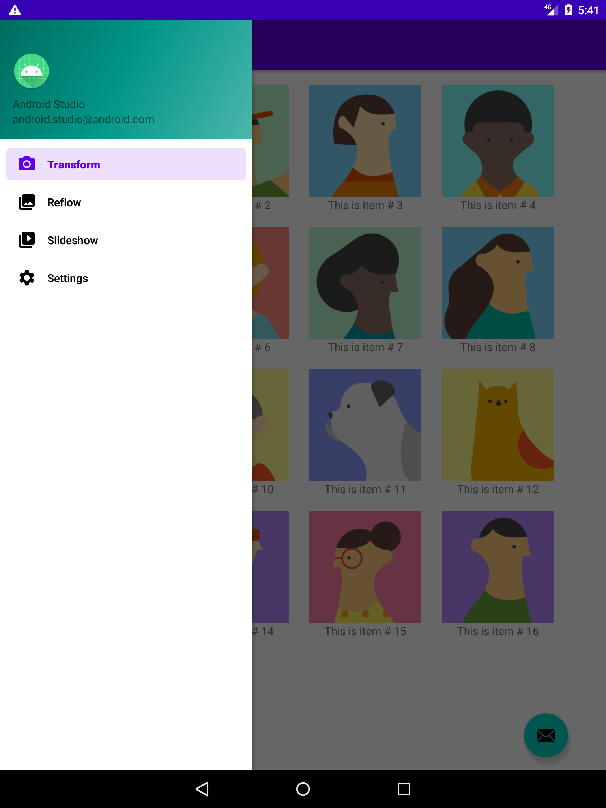
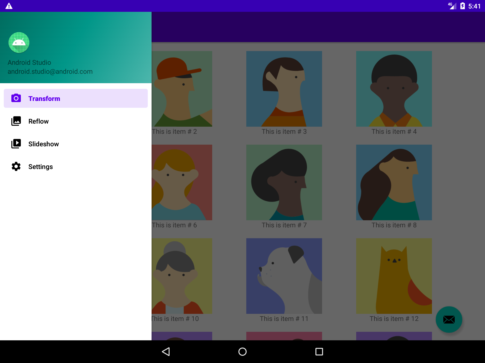
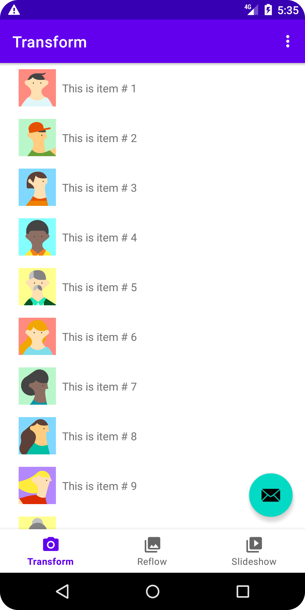
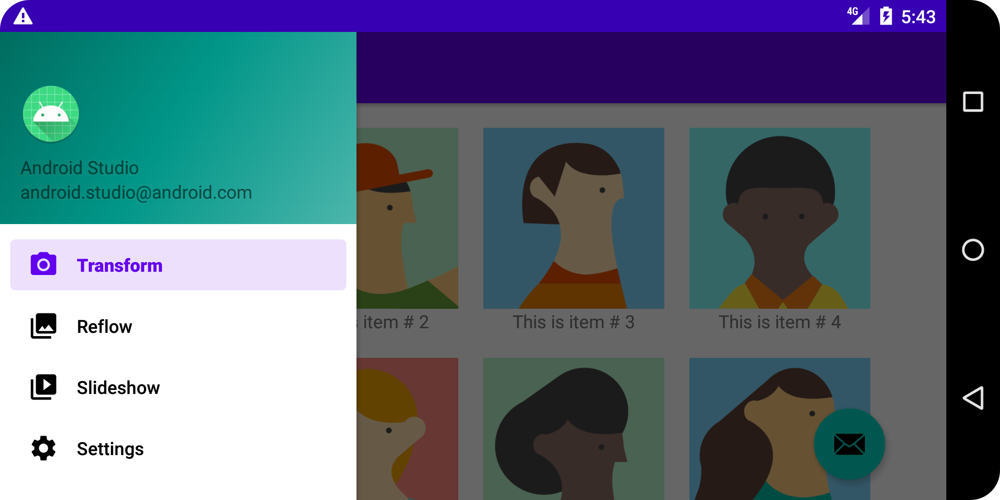

# Desarrollo De Aplicaciones Moviles

### Ejercicio práctico
## Introducción a Android
Crear una aplicación utilizando Android Studio con las siguientes especificaciones:

* Nombre: AppPractica1
* Nombre del paquete: com.curso.android.app.practica.uno
* Versión mínima a soportar: Android 5
* Basa en un template del tipo: Vista Primaria con Detalle

>__Vista Primaria con Detalle__ no estaba listada, en cambio, usé Responsive Views Activity
___

### Actividad 1
## Crear un emulador del tipo Tablet, con un tamaño de pantalla de al menos 8”.
1. Correr la aplicación en el emulador en orientación Portrait (vertical).



2. Correr la aplicación en el emulador en orientación Landscape (horizontal).



___

### Actividad 2
## Crear un emulador del tipo Teléfono.
1. Correr la aplicación en el emulador en orientación Portrait (vertical).



2. Correr la aplicación en el emulador en orientación Landscape (horizontal).




___

### Actividad 3
## En ambos los casos:
Indicar que configuración tiene cada emulador creado (versión de Android, tamaño de pantalla, memoria RAM).

```
Properties
avd.ini.displayname              Celular 5 API 22
disk.dataPartition.size          2G
hw.cpu.ncore                     4
hw.device.name                   pixel_3
hw.lcd.height                    2160
hw.lcd.width                     1080
hw.ramSize                       1536
```
```
Properties
avd.ini.displayname              Tablet 5 API 22
disk.dataPartition.size          2G
hw.cpu.ncore                     4
hw.device.name                   Nexus 9
hw.lcd.height                    1536
hw.lcd.width                     2048
hw.ramSize                       1536
```


Realizar capturas de pantalla de cómo se ven todas las pantallas de la aplicación en cada configuración.


___

### Actividad 4
¿Qué diferencia observás en el funcionamiento de la aplicación en una tablet con orientación Landscape y un teléfono con orientación Portrait?

>La pantalla de la tablet oculta la barra de navegación pero usa todo el espacio disponible para mostrar la información principal.

___

### Actividad extra
1. ¿En qué archivo está el nombre de tu aplicación? Probá cambiarlo y correr la aplicación nuevamente.

>El nombre de mi aplicación esta en en el archivo **strings.xml**, si lo modifico cambia el nombre con el que mi aplicación aparece en el dispositivo.

2. ¿Y el ícono?

>El ícono se encuentra en los archivos __ic_launcher.webp__ o __ic_launcher_round.webp__, hay varios dependiendo de los dpi del dispositivo final
